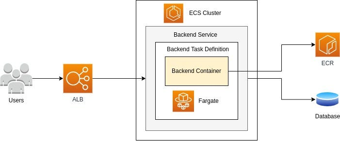

# Hillel Trip Planner backend

### Application that enable users to plan and book various aspects of their trip, including hotels, car rentals, flights, restaurants, and sightseeing activities.


[](https://sonar.ownerofglory.com/dashboard?id=Hillel-Trip-Planner)


## Prerequisites

- Java Development Kit (JDK) version 17.
- Apache Maven version 4.0.
- MySQL DB version 8.X.XX

## Tools Used

- Spring Framework version 6.X.X or higher
- Spring Boot version 3.2.X
- Hibernate ORM version 6.1.X.
- Apache Tomcat version 10

## Local Development

### Build

To build the project, execute the following command:

```bash
./mvnw --batch-mode clean package 
```
### Testing

To run tests, execute the following command:

```bash
./mvnw --batch-mode test
```

### Running

Environment variables

    MYSQL_DRIVER=com.mysql.cj.jdbc.Driver
    MYSQL_URL=jdbc:mysql://<host>:<port>/<database>
    MYSQL_USER=<username>
    MYSQL_PASSWORD=<password>
    AUTH_ERROR_REDIRECT_URL=<url>
    AUTH_SUCCESS_REDIRECT_URL=<url>
    GOOGLE_CLIENT_ID=<url>
    GOOGLE_CLIENT_SECRET=<url>
    GOOGLE_TOKEN_URL=<url>
    GOOGLE_AUTH_GRANT_TYPE=<grant>
    JWT_SECRET=<256-bit-secret>

### Building the docker image
- Uncomment the lines for the local deployment and comment the prod instructions

### Run the app with docker compose

Run docker-compose command

- Replace env variable values with relevant values
```shell
  docker-compose up -d
```

### Deployment local

Using Tomcat Smart Plugin for IntelliJ IDEA

Consider using the Tomcat Smart Plugin for IntelliJ IDEA to simplify the local deployment process. This plugin allows you to manage and deploy applications to Tomcat directly from your IDE, saving you time and effort.

Сan also be done manually:
- Build the WAR file using the command mentioned above.
- Copy the generated WAR file (usually found in the target folder) to the webapps directory of your Tomcat installation.
- Start the Tomcat server by executing the startup script (./bin/startup.sh for Unix or ./bin/startup.bat for Windows).
- Access the application at http://localhost:8080/hillel-trip-planner-web in your web browser, where hillel-trip-planner-web is the name of the WAR file.


### Deployment to AWS ECS Fargate

ECS Fargate architecture


> Recommendation: make yourself familiar with
[Official AWS guide ECS Fargate](https://docs.aws.amazon.com/AmazonECS/latest/developerguide/AWS_Fargate.html)

- Create ECS cluster
- Create ECS task definition
  - Copy and paste the task definition as JSON into the file [.aws/ecs-task-def.json](./`.aws/ecs-task-def.json)
  - Replace sensitive data with placeholders, consider placweholders in the deployment pipeline [.github/workflows/ecs-deployment-pipeline.yml](./.github/workflows/ecs-deployment-pipeline.yml)
- Create repo variable and secrets defined in the pipeline definition [.github/workflows/ecs-deployment-pipeline.yml](./.github/workflows/ecs-deployment-pipeline.yml)
- Deployment pipeline is triggered manually
 
### Deployment remote Tomcat (prior to SpringBoot migration)

To deploy your application remotely, use the following command:

```bash
./mvnw --batch-mode --update-snapshots package cargo:deploy \
-Dtomcat.host=<TOMCAT_HOST> \
-Dtomcat.user=<TOMCAT_USER> \
-Dtomcat.password=<TOMCAT_PASSWORD> \
-Dtomcat.managerUrl=<TOMCAT_MANAGER_URL>
```

